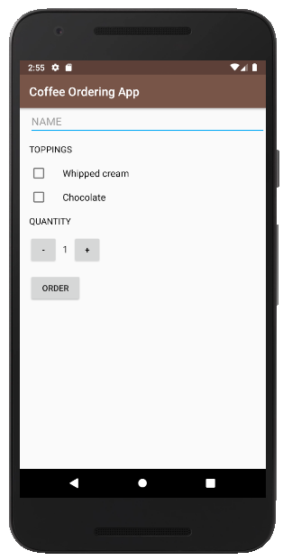
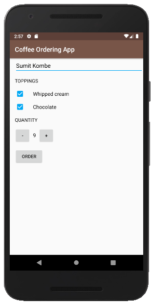

# Coffee Ordering App
## **Description**  
An app that can order **coffee** alongwith some **toppings** on it in the blink of an eye.All you need to do is **Enter** your 
**name**, set the **quantity**, add **toppings** of your choice and most importantly click the **order** button and magically you 
will be taken to your **email app** where all the order details along with **bill summary** will be already typed in as your 
messag.Now just enter the **coffee shop email id** and again most importantly don't forget to press the **Send** button.Thus you 
can order **coffee in a jiffee**.  

## **Screenshots**  

  

## Credits  
I have developed this project as a part of Udacity's Android Basics course with the resources provided by them.I have shared this 
project so that other students/developers can use it as **reference for learning** and most importantly for my **Personal 
Visibility**.  

## Warning  
The use of this project for **Plagiarism** is **not** at all **entertained**.Udacity has clearly mentioned in their policy that 
Plagiarism is strictly prohibited and if someone found guilty will result in his/her **Account Ban** on Udacity.So be a responsible
developer and **Say No To Plagiarism**.

## MIT License  

Copyright (c) 2019 Sumit Kombe

Permission is hereby granted, free of charge, to any person obtaining a copy
of this software and associated documentation files (the "Software"), to deal
in the Software without restriction, including without limitation the rights
to use, copy, modify, merge, publish, distribute, sublicense, and/or sell
copies of the Software, and to permit persons to whom the Software is
furnished to do so, subject to the following conditions:

The above copyright notice and this permission notice shall be included in all
copies or substantial portions of the Software.

THE SOFTWARE IS PROVIDED "AS IS", WITHOUT WARRANTY OF ANY KIND, EXPRESS OR
IMPLIED, INCLUDING BUT NOT LIMITED TO THE WARRANTIES OF MERCHANTABILITY,
FITNESS FOR A PARTICULAR PURPOSE AND NONINFRINGEMENT. IN NO EVENT SHALL THE
AUTHORS OR COPYRIGHT HOLDERS BE LIABLE FOR ANY CLAIM, DAMAGES OR OTHER
LIABILITY, WHETHER IN AN ACTION OF CONTRACT, TORT OR OTHERWISE, ARISING FROM,
OUT OF OR IN CONNECTION WITH THE SOFTWARE OR THE USE OR OTHER DEALINGS IN THE
SOFTWARE.
